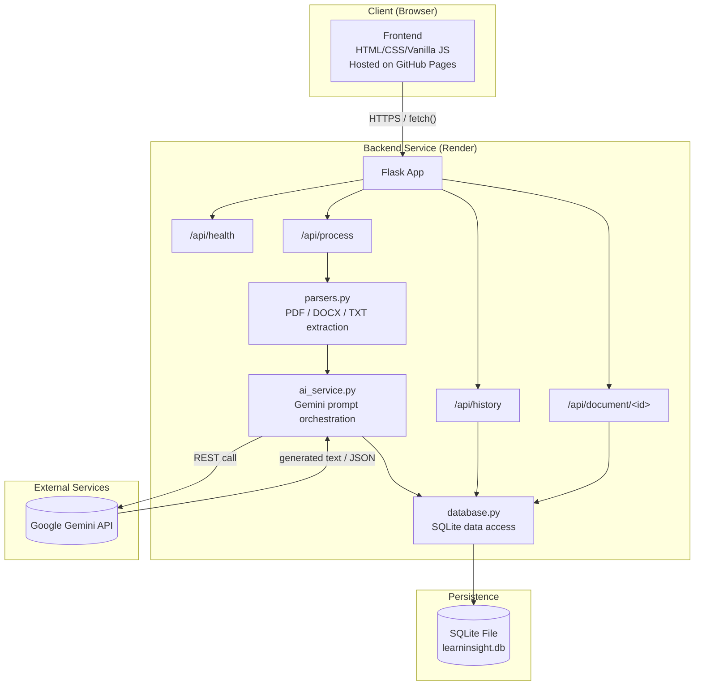
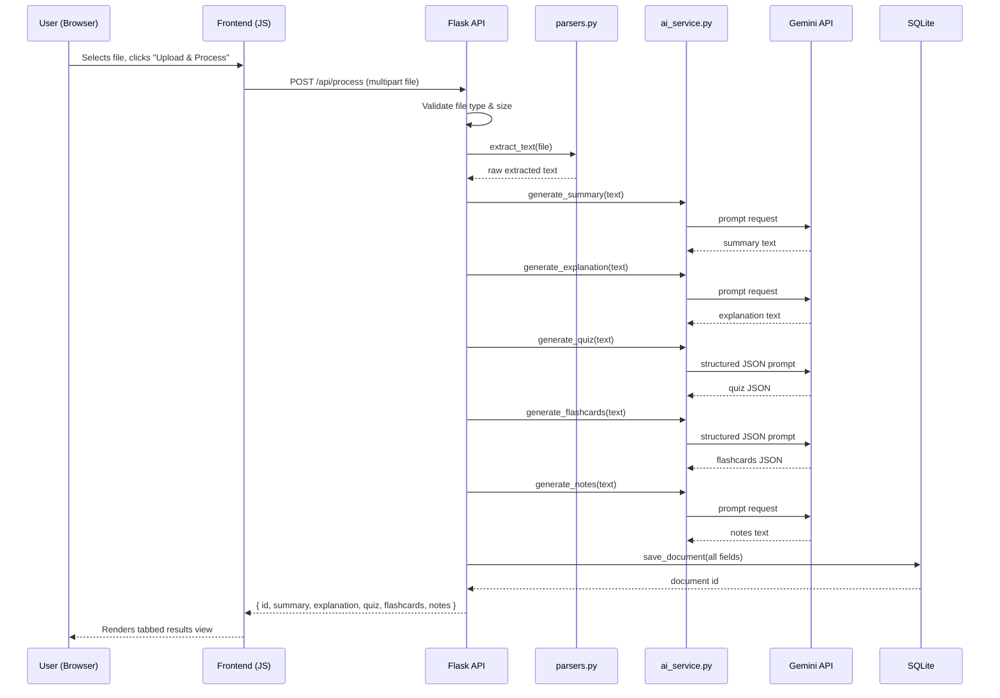

# LearnInsight AI — System Architecture

**Status:** Approved — Day 2 Design
**Source of truth references:** PRD v1.0, Implementation Blueprint (Days 2–10)

---

## 1. Finalized Tech Stack

| Layer | Choice | Why This Fits |
|---|---|---|
| **Frontend** | HTML, CSS, Vanilla JavaScript | Matches current skill level exactly (no React learning curve mid-sprint); fully sufficient for the UI complexity required (upload form, tabs, quiz, flashcards, dashboard); zero build tooling, so GitHub Pages can serve it directly. |
| **Backend** | Python 3 + Flask | Lightweight REST framework, minimal boilerplate, plays to existing Python comfort; ideal for a small number of well-defined endpoints rather than a large application. |
| **Database** | SQLite (via Python's built-in `sqlite3`) | Zero-config, file-based, no separate database server to install, run, or pay for. Perfectly adequate for a single-user, portfolio-scale v1.0. Upgrading to Postgres later (if multi-user auth is ever added) is a contained, well-understood migration — not a v1.0 concern. |
| **Authentication** | None (v1.0) | PRD explicitly scopes v1.0 as single-user / local-demo. Adding auth now would introduce session management, password storage, and security surface area with no corresponding user story in the PRD. Explicitly deferred to the Future Roadmap. |
| **AI Model/API** | Google Gemini API (free tier) | Generous free quota, simple REST/Python SDK, no billing setup required — matches the "no paid tools" standing rule. Supports both free-form text generation (Summary, Explanation, Notes) and structured JSON generation (Quiz, Flashcards). |
| **File Parsing** | PyPDF2 (or pdfplumber), python-docx, built-in file I/O | Standard, well-documented, free libraries with no external service dependency — parsing happens entirely inside the backend process. |
| **Frontend Hosting** | GitHub Pages | Free, already familiar to you, integrates directly with your existing GitHub workflow, and is a perfect fit for a static frontend with no server-side rendering needs. |
| **Backend Hosting** | Render (free tier) | Free tier supports a persistent Python web service (unlike purely static hosts), straightforward GitHub-connected deploys, and supports environment variables for secrets. |
| **Other Tools** | `flask-cors`, `python-dotenv`, `gunicorn` (production only, Day 10) | CORS handling for the cross-origin GitHub Pages → Render calls; secure local secret management; production-grade WSGI server for deployment. |

No changes from the Implementation Blueprint's locked stack — this table simply documents the *why* behind each choice for the record.

---

## 2. Component Diagram

---

## 3. Data Flow (Document Processing)

---

## 4. Request Lifecycle (Generic)

1. **Browser** sends a `fetch()` request to the Render-hosted Flask API over HTTPS.
2. **Flask** receives the request, and `flask-cors` confirms the request's origin (GitHub Pages domain) is permitted.
3. The relevant **route handler** in `app.py` validates input (file type/size, or document ID format).
4. The route delegates to the appropriate module — `parsers.py` for extraction, `ai_service.py` for generation, or `database.py` for persistence/retrieval.
5. The route handler assembles a JSON response and returns it with an appropriate HTTP status code.
6. **Frontend** receives the JSON, updates application state, and re-renders the relevant view (results, history list, or error message).

---

## 5. AI Interaction Detail

- All Gemini calls are isolated inside `ai_service.py` — no other module calls the Gemini API directly. This keeps prompt engineering, error handling, and retry logic in one place.
- Two prompt patterns are used:
  - **Free-form text generation** — Summary, Simplified Explanation, AI Notes. Each has a distinct, explicit prompt so outputs don't overlap in style or depth.
  - **Structured JSON generation** — Quiz, Flashcards. Prompts explicitly instruct Gemini to return only valid JSON in a defined shape; the backend validates/parses this before storing or returning it, with a fallback path to strip stray markdown code fences if the model adds them.
- **Error handling:** every Gemini call is wrapped in a try/except that catches timeouts, rate-limit errors, and malformed responses, returning a clear error message to the frontend rather than crashing the request.

---

## 6. External Services

| Service | Role | Notes |
|---|---|---|
| Google Gemini API | AI text/JSON generation | Free tier; API key stored as an environment variable, never committed to the repo. |
| GitHub Pages | Static frontend hosting | Serves `frontend/` directly; no build step required. |
| Render | Backend hosting | Runs the Flask app as a persistent web service; free tier may "sleep" after inactivity (documented in README, not treated as a bug). |

---

## 7. Design Notes / Deviations from Day 1

None. This document formalizes the architecture already implied by the Implementation Blueprint — no conflicting decisions were required.
