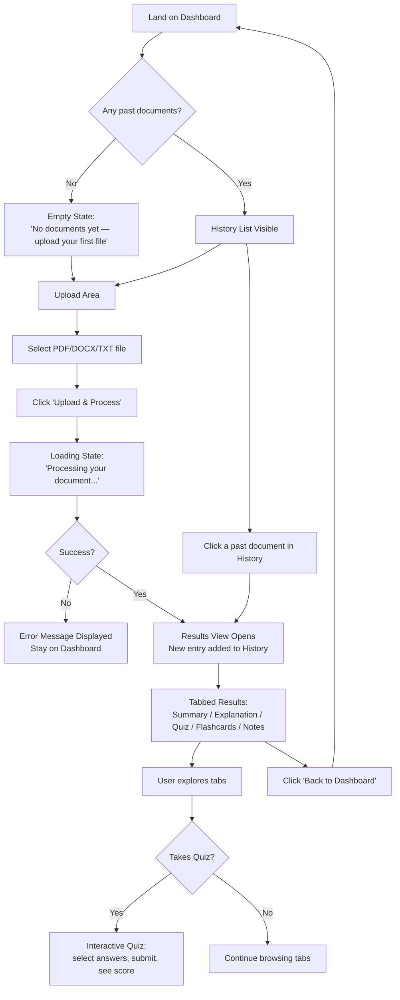

# LearnInsight AI — UI & User Flow Design

**Status:** Approved — Day 2 Design
**Fidelity:** Low-fidelity wireframes (layout and structure, not visual styling — visual design is a Day 7–8 concern)

---

## 1. User Flow Diagram



---

## 2. Screen Flow

There are exactly **two screens** in v1.0 — kept deliberately minimal so every screen earns its place:

1. **Dashboard** — the single entry point. Contains the upload area and the history list. This is also the screen the user returns to after viewing results.
2. **Results View** — shown either right after processing a new document, or after clicking a past document from history. Contains the 5-tab results display.

No separate "loading page," "settings page," or "login page" — none of these are needed given the v1.0 scope (no auth, no configurable settings).

---

## 3. Wireframe — Screen 1: Dashboard

```
┌──────────────────────────────────────────────────────────────┐
│  LearnInsight AI                                              │
├──────────────────────────────────────────────────────────────┤
│                                                                │
│   ┌────────────────────────────────────────────────────┐     │
│   │                                                      │     │
│   │     📄  Drag & drop a file here, or click to browse  │     │
│   │         Supports: PDF · DOCX · TXT                   │     │
│   │                                                      │     │
│   │              [  Upload & Process  ]                  │     │
│   └────────────────────────────────────────────────────┘     │
│                                                                │
│   Your Documents                                              │
│   ┌────────────────────────────────────────────────────┐     │
│   │  📄 chapter3_notes.pdf            Jul 23, 2026  >   │     │
│   ├────────────────────────────────────────────────────┤     │
│   │  📄 biology_intro.docx            Jul 22, 2026  >   │     │
│   ├────────────────────────────────────────────────────┤     │
│   │  📄 history_essay.txt             Jul 21, 2026  >   │     │
│   └────────────────────────────────────────────────────┘     │
│                                                                │
└──────────────────────────────────────────────────────────────┘
```

**Empty state (no documents yet):**
```
│   Your Documents                                              │
│   ┌────────────────────────────────────────────────────┐     │
│   │                                                      │     │
│   │     No documents yet.                                │     │
│   │     Upload your first file above to get started.     │     │
│   │                                                      │     │
│   └────────────────────────────────────────────────────┘     │
```

**Loading state (during processing):**
```
│   ┌────────────────────────────────────────────────────┐     │
│   │        ⏳  Processing your document...               │     │
│   │        This usually takes a few seconds.              │     │
│   └────────────────────────────────────────────────────┘     │
```

**Error state:**
```
│   ┌────────────────────────────────────────────────────┐     │
│   │  ⚠  We couldn't process that file. Please try a     │     │
│   │     different PDF, DOCX, or TXT file.                │     │
│   └────────────────────────────────────────────────────┘     │
```

---

## 4. Wireframe — Screen 2: Results View

```
┌──────────────────────────────────────────────────────────────┐
│  LearnInsight AI            [ ← Back to Dashboard ]           │
├──────────────────────────────────────────────────────────────┤
│  chapter3_notes.pdf  ·  Processed Jul 23, 2026                │
│                                                                │
│  [ Summary ] [ Explanation ] [ Quiz ] [ Flashcards ] [ Notes ]│
│  ──────────────────────────────────────────────────────────  │
│                                                                │
│   (Active tab content renders here)                           │
│                                                                │
│   Summary tab example:                                        │
│   "This chapter covers the three primary mechanisms of...     │
│    (concise structured summary text)"                         │
│                                                                │
└──────────────────────────────────────────────────────────────┘
```

**Quiz tab (interactive):**
```
│  Question 3 of 6                                              │
│  What is the primary function of mitochondria?                │
│                                                                │
│   ○  A) Protein synthesis                                     │
│   ○  B) Energy production                                     │
│   ○  C) Waste removal                                          │
│   ○  D) Cell division                                          │
│                                                                │
│              [ Next Question ]                                │
│                                                                │
│  ●●●○○○  (progress indicator)                                 │
```

**Quiz results screen:**
```
│   Your Score: 5 / 6                                            │
│                                                                │
│   ✓ Q1  ✓ Q2  ✗ Q3  ✓ Q4  ✓ Q5  ✓ Q6                          │
│                                                                │
│              [ Retake Quiz ]                                  │
```

**Flashcards tab (interactive):**
```
│              ┌────────────────────────┐                        │
│              │                        │                        │
│              │   What is photosynthesis?│                     │
│              │                        │                        │
│              │      (tap to flip)      │                        │
│              └────────────────────────┘                        │
│                                                                │
│              Card 2 of 8      [ < ]  [ > ]                    │
```

---

## 5. Navigation

- **Global:** A persistent header showing "LearnInsight AI" branding is present on both screens.
- **Dashboard → Results:** triggered by (a) successful upload processing, or (b) clicking a history item.
- **Results → Dashboard:** a single, always-visible "← Back to Dashboard" link/button in the Results View header.
- **Within Results:** tab navigation only — no nested sub-pages. Switching tabs never triggers a new network request (all 5 outputs are already loaded together from `/api/process` or `/api/document/<id>`).
- No deep linking / URL routing in v1.0 — this is a single-page app with JS-driven view switching (`showView()`), consistent with the vanilla JS, no-framework decision.

---

## 6. Why Only Two Screens

Every screen was tested against the question "does this exist for a reason tied to a PRD user story?"
- **Dashboard** — required for "upload a document" and "view history" user stories.
- **Results View** — required for displaying all 5 AI outputs and taking the quiz.

No login screen (no auth in scope), no settings screen (nothing configurable in v1.0), no separate "processing" page (handled as a state within the Dashboard, not a navigation event). This keeps the frontend build (Day 7) focused and avoids scope creep into unnecessary screens.
